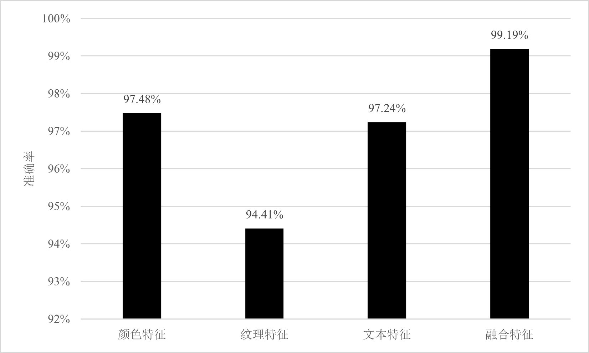
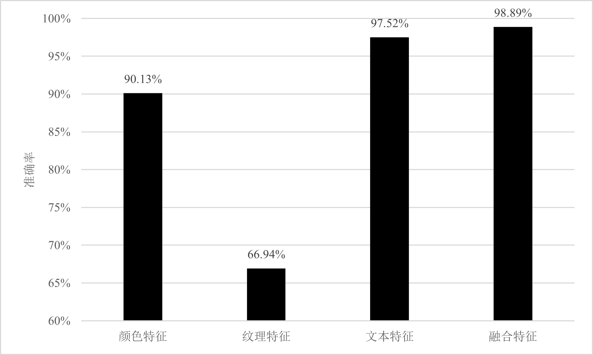
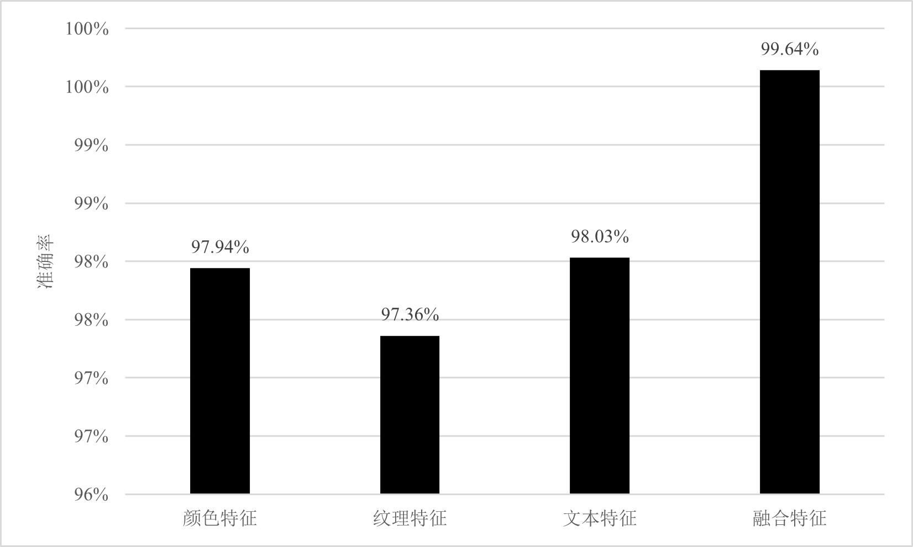
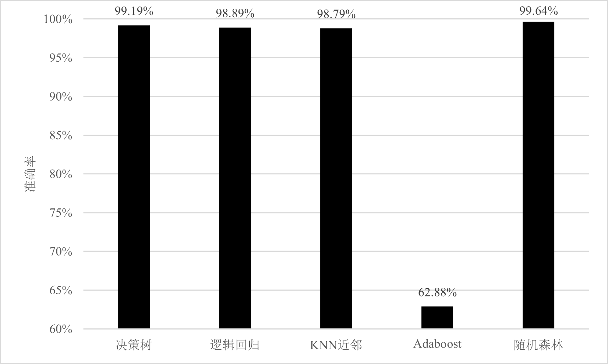

# EFEMalwareClassification

基于特征表达增强的恶意代码家族分类方法，首先反编译恶意代码源程序得到 .bytes文件和 .asm文件，然后通过N-Gram算法提取 .asm文件的文本特征，将两类文件转换成灰度图像，通过灰度共生矩阵和灰度直方图提取纹理特征和颜色特征，最后融合文本特征、纹理特征、颜色特征三类单一特征构建新的融合特征，增强恶意代码特征表达能力。 

## 数据集

- 比赛说明 https://www.kaggle.com/c/malware-classification/

- 数据下载 [Google Drive](https://drive.google.com/open?id=1C1Tc1dh8W8f3x6vn-Ado4mcBhn-EpaCO), [OneDrive](https://dlpwn-my.sharepoint.com/:f:/g/personal/deep_dlpwn_onmicrosoft_com/EhljOjr5llZBuUKWjWwKHS8BS8JrHyS76pzRU9RDKMDeoQ?e=dUgBNU)

## 代码说明

### 数据预处理
- `randomsubset.py` 抽取训练子集
- `getMap` 获取ASM文件和Byte文件的灰度图

### 特征提取
- `getColor.py` 获取灰度图像的颜色特征
- `getText.py` Opcode n-gram获取ASM文件的文本特征
- `getTexture.py` 获取ASM文件图像纹理特征

### 家族分类
- `ClassificationOfColor.py` 基于颜色特征的家族分类
- `ClassificationOfText.py` 基于文本特征的家族分类
- `ClassificationOfTexture.py` 基于纹理特征的家族分类
- `ClassificationOfFusion.py` 基于融合特征的家族分类

### 可视界面
- `MainWindow.ui` 主界面UI
- `MainWindow.py` 主界面UI对应的Pyqt代码
- `MainWindowControl.py` 主界面对应控件的逻辑

## 运行说明

1. 将完整的训练数据集解压，修改`randomsubset.py`中的路径并运行
2. 修改`getMap`中的路径，转换灰度图
3. 修改`getColor.py`,`getText.py`和`getTexture.py`中的路径，提取对应特征
4. 运行`run.sh`，耐心等待不同特征的家族分类结果
5. 运行`MainWindowControl.py`，进行简单功能演示

## 部分结果图
### 决策树

### 逻辑回归

### 随机森林

### 融合特征

